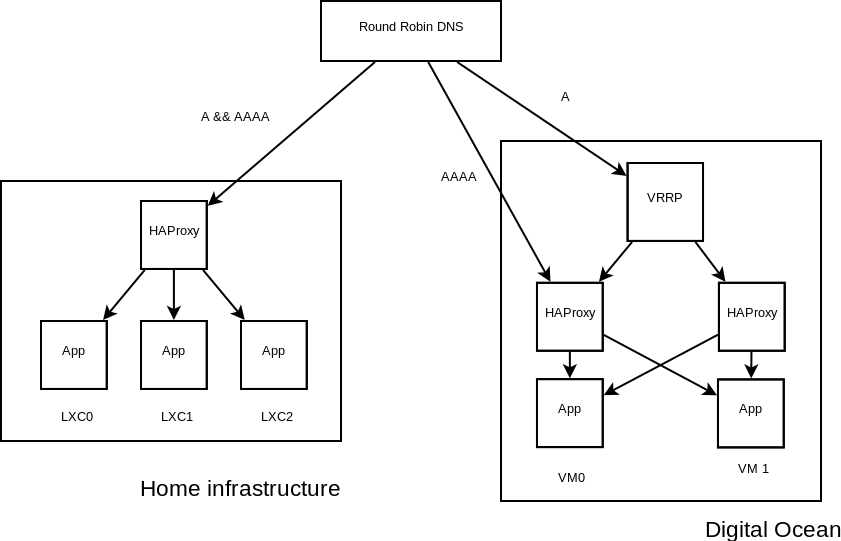

.. _design:

======
Design
======

This part will present the different design choices made for this project.

.. contents:: Table of Contents
   :depth: 3

.. _design_application:

Application
-----------

A separation between a frontend and a backend application has been adopted:
the last one provide a REST API, used by the first one to interact with it.

Python has been chosen for its simplicity. Compute time is not important here,
as the application relies mainly on its providers. The REST API is done by
`flask-restplus <https://github.com/noirbizarre/flask-restplus>`_, using
Swagger to provide data verification and documentation. ``requests`` is
used to implement a client for the 2 providers' web API.

.. _design_infrastructure:

Infrastructure
--------------

Different redundancy techniques have been used to host the daemon:

.. _infrastructure_img:

    Mail Sender infrastructure

The infrastructure is split as 2 main parts: my home infrastructure, and 2 vm
hosted on Digital Ocean. Round Robin DNS is used between each entry point.

On Digital Ocean, each host runs a HAProxy and Mail Sender Daemon (in a
docker). ``keepalived`` is used to setup VRRP, detecting if HAProxy is still
up, otherwise the other host will take up the relay. Digital Ocean only
provides IPv4 floating addresses, that is why the IPv6 is not included into
VRRP.

On my home infrastructure, a public IP is dynamically routed through OSPF
from a Online server. HAProxy is used, and load balances to 3 nodes, running
on LXC. VRRP cannot be used here, as Online does not provide a floating API,
and I do not have the control on the IP external announcement.
